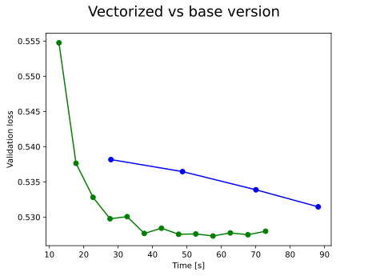

# TFT vectorization

Results to be reproduced simply by running `python example.py --variant="all"`
(on a GPU with satisfied `pip install -r requirements.txt` and of course with `CUDA_VISIBLE_DEVICES=0` set.)

# Explanation

Deep learning has conclusively conquered many areas of machine learning like image recognition, natural language processing etc. Time series forecasting, however, is one of the last holdouts, where despite deep neural networks having won several battles, the war is not yet decidedly won.

One of the most recent innovations in this area is the Temporal Fusion Transformer (TFT) neural network architecture introduced in [Lim et al. 2019](https://arxiv.org/abs/1912.09363) accompanied with implementation covered [here](https://github.com/google-research/google-research/tree/master/tft).

TFT brings together several interesting ideas for time series modelling. We wanted to explore the architecture and benchmark it with respect to well established models like the [SeriesNet architecture](https://ieeexplore.ieee.org/document/8489522/) by Shen et al. 2018, based on the popular WaveNet model by Google's DeepMind.

There is a major difference between TFT and SeriesNet both in architectures and implementations.

SeriesNet has convolutional architecture that can operate on whole sequences, giving results as the convolutional window slides over the data set.

The TFT architecture is derived from the Seq2Seq approach (with encoder and decoder), thus when operating on a sequence, it needs a specifically prepared (windowed) input. Consequently the training times of TFT are significantly longer than for SeriesNet.

Fortunately, there is a way to build the moving window algorithm to work in an accelerated manner on GPU with TensorFlow.

We have developed, and are sharing here our solutions in TensorFlow model engineering. We have tried to make the code as similar to the original while adding those updates and options for the model:
- Converting the model from TensorFlow version 1 to 2
- Creating the model with named inputs (and thus removing the part where it needed to decode all the information from the windows).
- Creating the model wrapped in vectorizing routines.
- Propagating the vectorization deeper in the model only where it is needed.

(All these steps have their corresponding parameterized examples included in the tests provided.)

The reason for all those steps is to make the work more accessible, and to showcase the vectorization technique first by regarding the TFT as a 'blackbox'.

#### Towards vectorization
The basic idea is that every TensorFlow model already works in a vectorizable manner - as the model needs to be able to call itself (in parallel) over the batch dimension(s) of the data.

###### Batch dimensions
Some models do accept more than one batch dimension. In these cases, we can squash all the batch dimensions into one, call the model and then restore the dimensions from the result.

Both operations however need to be done in TensorFlow to not introduce any slowdown:

    def squash_batch_dimensions(seq, batch_dims):
        """Squashes first (batch_dims) dimensions into 1 batch dimension."""
        batch_shape_orig = tf.shape(seq)[:batch_dims]
        retain_shape = tf.shape(seq)[batch_dims:]
        new_shape = tf.concat([[-1], retain_shape], axis=-1)
        seq_squashed = tf.reshape(seq, new_shape)
        return seq_squashed, batch_shape_orig
    
    def unsquash_batch_dimensions(seq: tf.Tensor, batch_shape_orig: Union[list, tf.Tensor]):
        """Restores additional dimensions previously squashed to the first batch dimension"""
        batch_dims = 1
        retain_shape = tf.shape(seq)[batch_dims:]
        new_shape = tf.concat([batch_shape_orig, retain_shape], axis=-1)
        seq = tf.reshape(seq, new_shape)
        return seq

###### Vectorization of a TensorFlow blackbox

So lets imagine we have disentangled the inputs in TFT from windowed encoding.

Now in its pure form, TFT needs to know historical (H) and future inputs (F) at each point in time (where some historical features are in fact included in the future if those are known in advance or are repetitive):

    H ##############################
    F -----##############################

Note that the sequence F is longer, since future known inputs need to be known also for the last historical input. The character '-' means, that this input will never be used and so is omitted.

Windowed approach takes - at each timestep - a specific number of H inputs and also the needed future inputs from F:

    H XXXXXXXXXX####################
    F -----#####XXXXX####################
               ^ as source data at each timepoint

And so if we want to introduce a parallel/vectorized approach for windowing, we need our data (labelled for better understanding):

    H 123456789012345678901234567890
    F -----FGHIJKLMNOPQRSTUVWXYZABCDEFGHI

To be reshaped as follows (read as columns, from top to bottom):

    1234...901 ^
    2345...012 |
    3456...123 |
    4567...234 |
    5678...345 |  Model's historical inputs
    6789...456 |
    7890...567 |
    8901...678 |
    9012...789 |
    0123...890 V <- last (H) inputs
    KLMN...CDE ^ <- first (F) inputs
    LMNO...DEF |
    MNOP...EFG |  Model's future inputs
    NOPQ...FGH |
    OPQR...GHI V

Now if we accept that our model needs to get executed on individual columns of data, we have just introduced a new batch dimension. Note, that it is still just a windowing technique applied on two streams (H and F) of data.

###### Implementing windowing
A technical detail on how to implement the windowing in TensorFlow needs to be discussed.
There are several possibilities - if there would be any vectorized version of slice or roll operation, that would be preferred.  However, since those operations are not present in vectorized version, we could also imagine using matrix multiplication, which is unfortunately too memory heavy.

Our final design uses the gather function. We first generate the integer indices and then just reshape the array to fit the target rectangle. (Target rectangle with the shape of the given window length and number of repeats. Number of repeats being the original sequence length - window length + 1.)

Overall tf documentation is full of similar ideas (see for example [here](https://www.TensorFlow.org/probability/api_docs/python/tfp/math/fill_triangular)).

The TensorFlow function we get needs also to respect existing batch dimensions:

    def windowing_mechanism(seq_data, batch_dims, window_len):
        """Reformats data in timesequence dimension into two dimensions of [number of windows, window length] by windowing.
    
        :param seq_data: Original data with time dimension at seq_data.shape[batch_dims] position
            and features at seq_data.shape[batch_dims:]
        :param batch_dims: Defines the number of dimensions to regard as batch at the start. Expects non-tensor.
        :param window_len: Window length to produce. Expects non-tensor (?)
        :return: windowed original sequence of shape:
            list(data.shape[:batch_dims])
            + [data.shape[batch_dims] - window_len + 1, window_len]
            + list(data.shape[batch_dims + 1 :])
        """
    
        rep = (
            get_shape_fixed_if_possible(seq_data)[batch_dims] - window_len + 1
        )  # when windowing, we will repeat that many times
    
        # as is first nonbatch dimension - window len + 1
        i = tf.range(0, window_len * rep, delta=1, dtype=None, name="range")  # now we will produce indexes for gather
        indices_orig = tf.math.floormod(i, window_len) + tf.math.floordiv(i, window_len)
        # in this manner: [[ 1,  2,  3,  4,  5,  ..  2,  3,  4,  5,  6,  ..  3,  4,  5,  6,  7, .. ]]
    
        # expand indices for aligning with batch dimension to use tf.gather on batched data:
        indices = expand_to_match_first_dims(indices_orig, seq_data, batch_dims)
        # should match all the batch dims before!
    
        result = tf.gather(seq_data, indices, batch_dims=batch_dims,)
        # now reshape it in the form of the matrix we want:
        new_shape = tf.concat(
            [tf.shape(seq_data)[:batch_dims], [rep, window_len], tf.shape(seq_data)[batch_dims + 1 :]], axis=-1
        )
        windowed = tf.reshape(result, new_shape)
        return windowed
        # ... now regard the first (batch_dims+1) dimensions as batches for any model to apply

Now, if we regard TFT only as a batchable blackbox, the function needs to be used on both F and H inputs. Together with a batch dimension squash:

    # windowing described in the docstring ^
    historical_windowed = windowing_mechanism(
        historical_inputs, batch_dims=1, window_len=self.num_encoder_steps
    )
    # since the insides of the model are not easily used on 4 dim sequence with first two dimesnions being batch
    # we need to squash the dimensions into the batch dimension:
    historical_windowed_squashed, historical_windowed_orig_size = squash_batch_dimensions(
        historical_windowed, batch_dims=2
    )
    
    # now we must repeat the batch dimension for static inputs to match the new batch dimension of "squashed"
    static_emb_repeated = repeat_multiply_batch_dimension(static_emb, tf.shape(historical_windowed)[1])
    
    future_windowed = windowing_mechanism(future_emb, batch_dims=1, window_len=self.get_future_fork_size())
    future_windowed_squashed, future_windowed_orig_size = squash_batch_dimensions(future_windowed, batch_dims=2)
    
    transformer_layer_squashed, attention_components = self.build_base_tft_graph(
        historical_windowed_squashed, future_windowed_squashed, static_emb_repeated
    )
    # back to 4D: (from 3D squashed to batch dimension)
    transformer_layer = unsquash_batch_dimensions(transformer_layer_squashed, historical_windowed_orig_size)

The beauty of this approach lies in the fact it can be used on any other model with even more simplicity (when it does not need both F and H streams).

This version of the model is tested in `test_tft_model_vectorized_saving` (that it saves and executes the graph properly).

##### Deeper into the provided code
By delving deeper into the model, we could make the model to accept only one stream (masking some inputs from H when F was needed) and using the batching-unbatching tricks only at the places needed.
It turns out that only LSTM (and probably attention) did need the batch dimension trick, everything else was vectorizable nicely (with some minor tinkering around fixing the negative dimensions).

The final version is tested in `test_tft_single_sequence`.

###### Technical notes
- All the tests are separated in their own processes to not mangle the TF graphs
- The TFT objects do keep their original interface, but some parameters are now unused in the new approaches. That is some sort of a balance by trying to keep the original code as intact as possible and providing new means of execution.
- The difference between acting as blackbox and propagating vectorization deep inside the model is based on a parameter to allow experimentation.

###### Benchmark setup
We have created an experimental setup with an artificial series featuring some noise and some hidden computational rules to test both model variants on a GPU.
To make the test as close to reality as possible, we have allowed the base version to use a bigger batch size than the vectorized one.
First, from the point of view of epoch times, we can see a tremendous speedup:

from 18 seconds per epoch (base version):

    Epoch 4/4
    901/901 [==============================] - 21s 23ms/step - loss: 0.4995 - val_loss: 0.5315

to 5 seconds per epoch (vectorized version):

    Epoch 4/13
    32/32 [==============================] - 5s 151ms/step - loss: 0.5060 - val_loss: 0.5298

Per step times are bigger in the vectorized version, since one step means looping over the whole sequence (while we feature 32 sequences per epoch).

While the engineering victory of a more than factor 4 speedup in epoch is very encouraging, we need to also check the time to reach the same level of validation loss.

The vectorized approach is summing all gradients and applying them all at once per epoch. Therefore, the number of required epochs increases slightly, as the technique provides also a smaller number of gradient updates.

Despite the increased number of epochs, the code runs faster in total in training. Inference benefits massively from the vectorization, since it does not require gradients.

We have plotted the times to an epoch together with its validation loss for both setups
(green being vectorized, blue basic):

If we look at the logs of both epochs #4 again, we can see that the basic version got near the level of 0.5315 in 88 seconds. While the vectorized version was at 0.5298 before 30 seconds elapsed.

So in this experiment, the vectorized version is roughly 3 times faster in terms of loss.

Even though we have fixed the seeds and random generators before each experiment to the same value,
the 'race' can never be fair. Each method is exploring the space differently and can have some sort of a numerical 'luck', which depends on the problem and data itself. The code is provided for experimenting and we encourage deeper benchmarking. You can also notice, that by setting the artificially generated data to an easier problem, the basic version can win, because it propagates gradients more often (i.e. after each timestep).

We note that our proprietary application of the TFT model shows a speed-up consistent with the experimental setup presented here.

### Conclusion
We translated the TFT model into TensorFlow 2.0 and have demonstrated a vectorization technique for windowing.
The vectorization brings performance speed-up both in terms of per epoch time and time to to reach same validation loss.

In a simple benchmark, we demonstrated reduction of the time per epoch by factor ~4 and the 'time to same loss' by factor ~3, consistent with our in-house real-world data applications.

The presented method is not a direct replacement for any windowing technique, but should serve as an addition to a library of techniques (as would, for example, a new optimizer serve in the context of all existing optimizers).

### Acknowledgements
We would like to thank the google engineering team for their initial work on TFT model, and of course to our collegues in AMP and AMPX, namely Simon Ondracek and Robert Suhada for their contributions to the project.